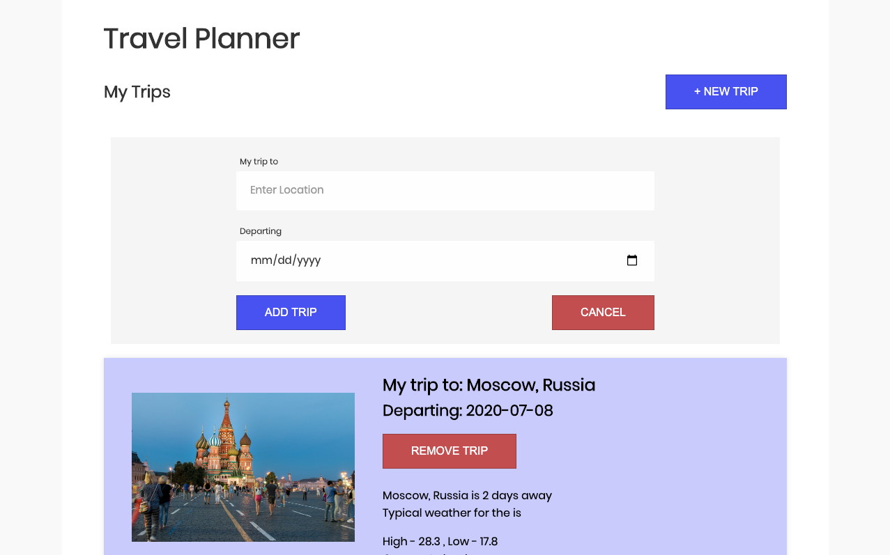
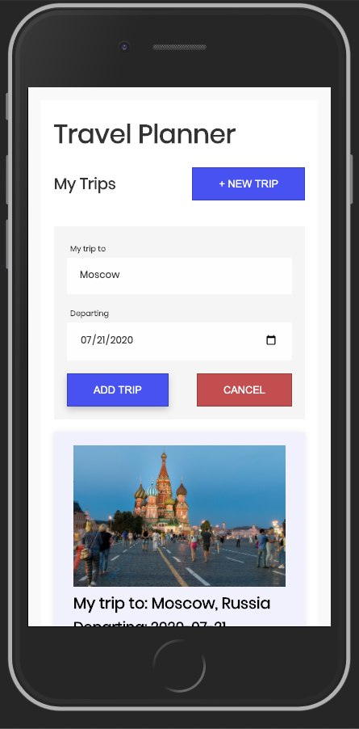

# Travel planner

Application to store the planned trips, this web application that uses 3 differents API's to get information about weather, countries and images.

## Getting started

To run the project:

1. Clone the repo

```sh
git clone https://github.com/gersongams/FEDN-capstone
```

2. Install the dependecies

```sh
npm install # Or use yarn
```

3. Set up the enviroments variables, create a file `.env` and fill it

```.env
username=YOUR_GEONAMES_USERNAME
PORT=8080
weatherbit_api=YOUR_WEATHERBIT_API_KEY
pixabaykey=YOUR_PIXABAYKEY_API_KEY
```

4. To run the server (dev mode):

```sh
yarn dev
```

4. To run the frontend

```sh
yarn build-dev
```

Go to the http://localhost:8081 and test the app

## Production mode

To run the project in production mode run:

```sh
yarn start
```

## Tools used

- [Express](https://expressjs.com/) - For the backend
- [Webpack](https://webpack.js.org/) - Module bundler
- [Sass](https://sass-lang.com/) - CSS preprocessor
- [Babel](https://babeljs.io/) - JavaScript Compiler
- [Jest](https://jestjs.io/) - Testing suit

## Demo

There is a demo for this application running in [https://news-evaluator-nlp.herokuapp.com/](https://news-evaluator-nlp.herokuapp.com/)

## Desktop version



## Mobile version



## Authors

Gerson garrido [@gersongams](https://github.com/gersongams/)
